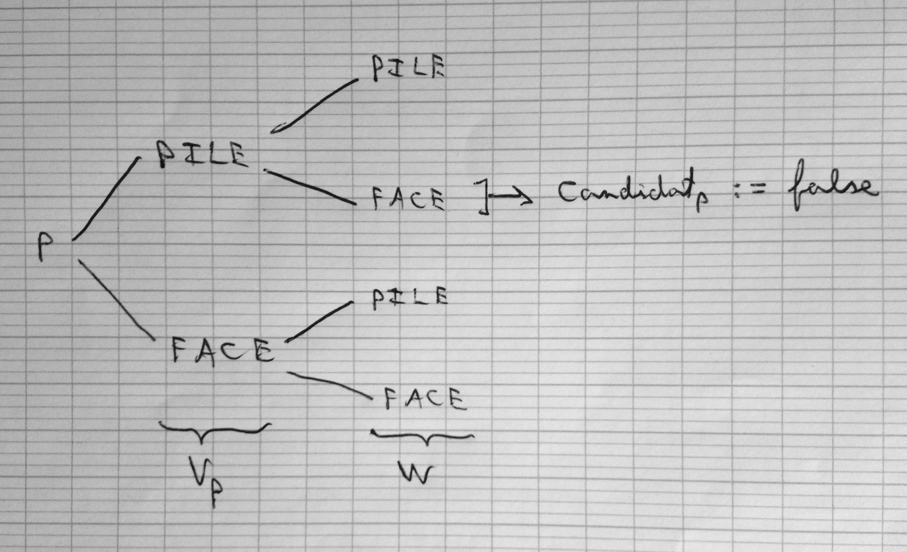

# Devoir maison n° 2 #

> Auteurs

- Fekih Ahmed Meriem
- JEAN-PIERRE Luxon


## Exercice n° 1 ##

Hypothèses:

- La probabilité d'avoir PILE et FACE après avoir exécuté la fonction *tirer()* est identique

```P(PILE) = P(FACE) = 1/2```

- Tous les tirages sont indépendants


> Question (a)

Démontrons par l'absurde l'affirmation formulée dans l'énoncé.

Supposons qu'au début de la ronde *r*, il y a au moins un candidat,
et qu'à la fin de la ronde *r*, il n'y a plus de candidat.

Cela signifie donc que tous les processus qui étaient candidats au début de la ronde *r*,
ne le sont plus a la fin de *r*. Donc tous les processus ont eu la condition suivante :

```
Vₚ = PILE and W = FACE
```

C'est en particulier vrai pour un seul processus candidat.

Soit *p* ce processus candidat. Par hypothèse, *p* n'est plus candidat à la fin de la ronde *r*.
Les autres processus n'étant pas candidats, ils ne font que retransmettre le message
reçu, sans modifier son contenu. *p* recevra donc *W* tel que
```Vₚ = W```. Or, *p* n'est plus candidat à la fin de la ronde *r*, et doit avoir
```Vₚ = PILE and W = FACE ``` en condition. C'est **contradictoire**.

**Conclusion** : Si au début de la ronde *r*, il y a au moins un candidat,
alors à la fin de la ronde *r*, il n'y a aussi au moins de candidat.


> Question (b)

Pour répondre à cette question, nous avons fait un arbre de probabilité, afin de connaitre
la probabilité qu'un processus candidat *p* ne soit plus candidat à la fin d'une ronde *r*.


TODO mettre la photo de l'arbre de probabilité

La probabilité que *p* ne soit plus candidat à la fin de la ronde,
qu'on notera P(!Candidatₚ) est de: ```P(!Candidatₚ) = 1/4```.

Soit P(Candidatₚ) la probabilité qu'un candidat *p* soit toujours candidat
à la fin d'une ronde *r*, telle que ```P(Candidatₚ) = 1 - P(!Candidatₚ) = 3/4```

En réalité, cette probabilité ne s'applique que si l'on a deux processus candidats.
S'il y en a qu'un seul, alors ```P(Candidatₚ) = 1``` (d'après question (a))

Pour *n* processus, ```n > 2```, on devrais avoir ```P(Candidatⁿₚ) = (3/4)ⁿ⁻¹``` (non démontré)


> Question (d)

Variables:

- Candidatₚ : booléen
- Vₚ : booleén
- n : entier, taille de l'anneau, *connue* de **tous les processus**. ```n ≠ 0```

```
for r := 0 to ∞ do
  if Candidatₚ
  then
    Vₚ := tirer()
    send < Vₚ, n, false > to Successeurₚ
    receive < W, K, S > from Predecesseurₚ
    if Vₚ = Pile and W = Face
    then
      Candidatₚ := false
    else
      if Vₚ = W and K = 1  // je suis le seul candidat restant
      then
        send < Vₚ, ⊥, true > to Successeurₚ
        receive < Vₚ, ⊥, true > from Predecesseurₚ // le message reçu reste inchangé
        exit()  // fin de l'algo côté candidat/leader
      endif
    endif
  else
    receive < W, K, S > from Predecesseurₚ
    if S = false
    then
      send < W, K - 1, S > to Successeurₚ
    else
      send < W, ⊥, S > to Successeurₚ
      exit()    // fin de l'algo pour le perdant
    endif
  endif
```

Explication:

L'idée est de faire en sorte à ce que chaque processus candidat puisse savoir
s'il est le dernier candidat en lice. Pour cela, chaque candidat va envoyer le triplet suivant:

```
< W, K, S >

- w ∈ { Pile, Face }
- K: nombre de processus potentiellement candidats (K = n au début)
- S: booléen indiquant si un leader a été désigné
```

Les processus qui ne sont pas candidats vont décrémentéer K,
sauf si un leader a été désigné (```S = true```).

Un processus candidat va, en plus de vérifier s'il a perdu,
s'assurer que ```W = Vₚ```, mais aussi vérifier qu'il est bien le seul candidat.
Si c'est le cas, alors cela signifie que causalement, il a reçu son propre message.
Par conséquent, il va envoyer le message ```< Vₚ, ⊥, true >``` qui traversera tout l'anneau
afin de signaler aux autres processus (qui sont perdants) d'arrêter l'algorithme.

Montrons que cette algorithme respecte les deux propriétés suivantes:

**1**. Si l'algorithme termine, alors il ne reste plus qu'un seul processus candidat

**2**. La probabilité que l'algorithme termine est 1 (plus exactement la probabilité
    qu'il ne termine pas avant la ronde *r* tend vers 0 quand *r* tend vers l'infini)

Montrons par l'absurde la propriété (**1**).

Supposons que l'algorithme termine et qu'il reste au moins 2 processus candidats.

Cela signifie que les deux processus ont eu la condition suivant comme étant vraie :

```Vₚ = W and K = 1```

Les deux processus ont donc la même valeur Vₚ, ce qui est possible.
Deux plus, ```K = 1```. Donc, cela signifie qu'il ne reste qu'un seul processus.
Or, on a supossé qu'à la fin de l'algorithme, il reste deux processus candidats au moins.
C'est contradictoire.

La propriété (1) est donc vraie.

Pour la propriété (2) le raisonnement devrait être similaire à ce qui a été fait
pour la permière version de l'algorithme (celle qui ne termine pas).

> Question (e)

Il suffit de reprendre l'algorithme précédent en effectuant les modifications suivantes :

Variables:

- Candidatₚ : booléen
- Vₚ : booleén
- n : entier, taille de l'anneau, *connue* de **tous les processus**. ```n ≠ 0```
- pid: identifiant du processus. Valeur initiale : ⊥

```
for r := 0 to ∞ do
  if Candidatₚ
  then
    Vₚ := tirer()
    send < Vₚ, n, false > to Successeurₚ
    receive < W, K, S > from Predecesseurₚ
    if Vₚ = Pile and W = Face
    then
      Candidatₚ := false
    else
      if Vₚ = W and K = 1  // je suis le seul candidat restant
      then
        pid := 0    // le leader à l'identifiant 0
        send < Vₚ, pid + 1, true > to Successeurₚ
        receive < Vₚ, K, true > from Predecesseurₚ
        exit()  // fin de l'algo côté candidat/leader
      endif
    endif
  else
    receive < W, K, S > from Predecesseurₚ
    if S = false
    then
      send < W, K - 1, S > to Successeurₚ
    else
      pid := K      // identifiant
      send < W, pid + 1, S > to Successeurₚ
      exit()    // fin de l'algo pour le perdant
    endif
  endif
```

## Exercice n° 2 ##

Nous n'avons pas réussi à faire un algorithme d'élection correct.
